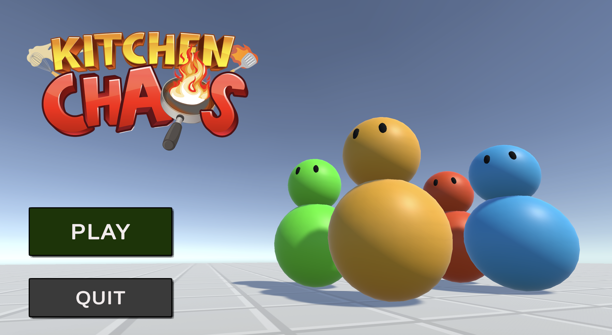
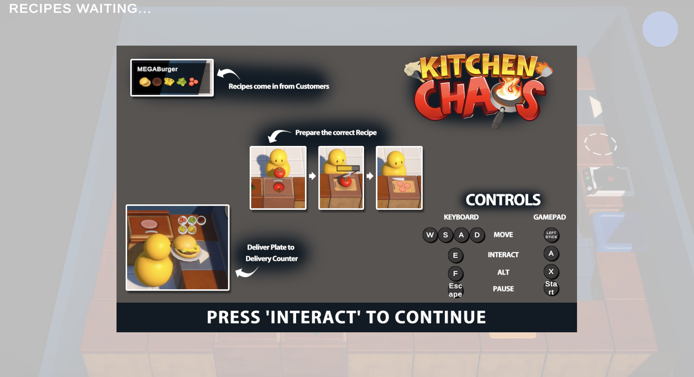
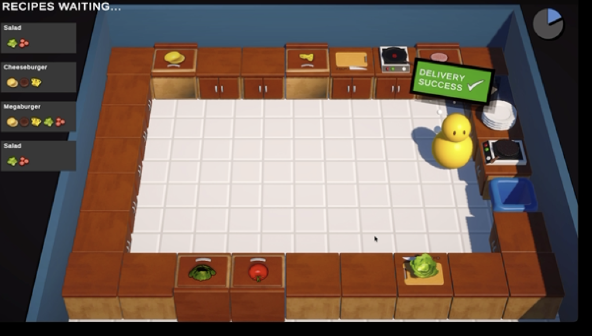
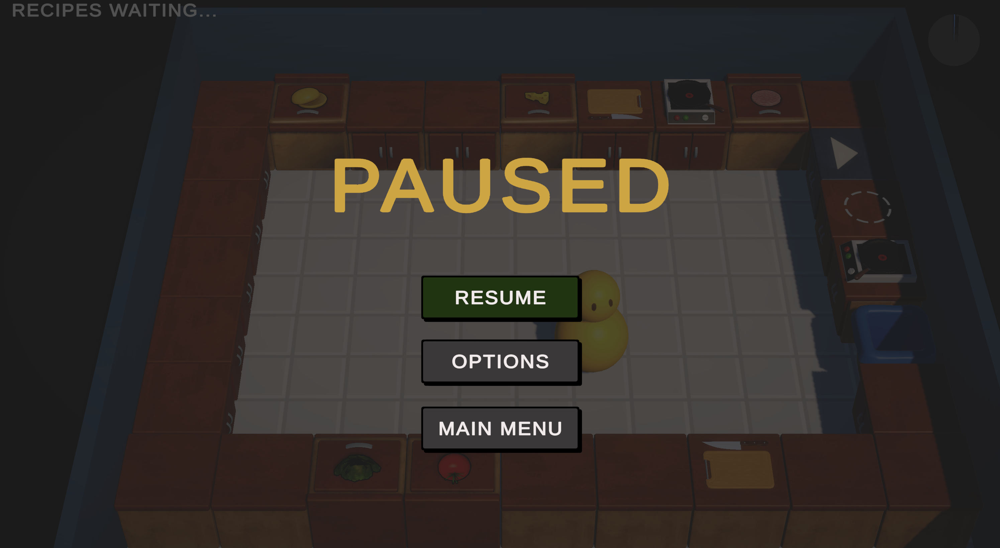
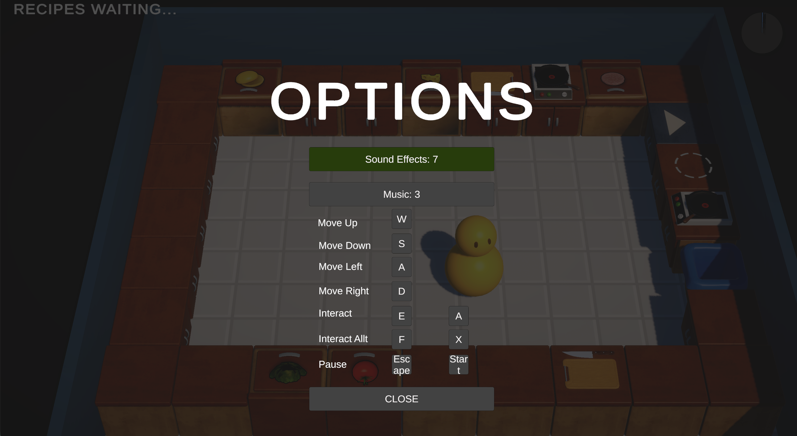
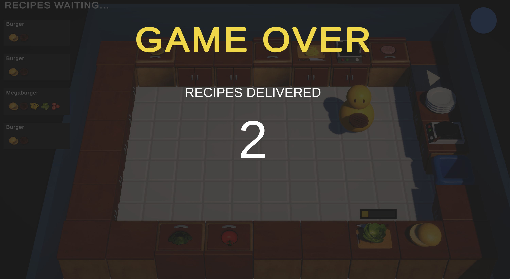

This project is recreation of KitchenChaos Unity Game tutorial by code monkey for learning purpose.

https://unitycodemonkey.com/kitchenchaoscourse.php

Learned topics:

    * Character movements
    * Event Handling
    * Scriptable Objects
    * User Interface
    * Adding sounds
    * Binding Inputs
    * Particle effects

Gameplay recordings:

   
   &nbsp;&nbsp;
   
   
   &nbsp;&nbsp;
   
   
   &nbsp;&nbsp;
   

<!-- <video src="Gameplay/Videos/Gameplay.mov" width="600" controls>
  Your browser does not support the video tag.
</video> --!>

<video src="https://github.com/user-attachments/assets/0a18497f-cafa-4bde-9c9c-a4a882d4a9a0" width="600" controls></video>
<video src="https://github.com/user-attachments/assets/da644b1e-7596-458a-a69f-66df81f62065" width="600" controls></video>
<video src="https://github.com/user-attachments/assets/ff366dc8-ff14-46b6-bbe7-9a58539e8fc1" width="600" controls></video>
<video src="https://github.com/user-attachments/assets/f80febc5-57e9-43f5-9b12-0e81579c03dd" width="600" controls></video>
